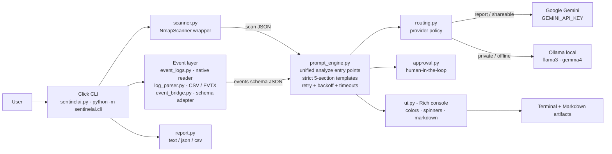

# SentinelAI 🛡️

> **AI-powered defensive-security CLI agent** — one command from raw scan data or Windows Event Logs to a professional, LLM-written security analysis.
> Built by **Team Finatics** for CodeQuest.

[](https://www.python.org/)
[](https://click.palletsprojects.com/)
[](https://rich.readthedocs.io/)
[](#llm-providers)

---

## What it does

SentinelAI automates the boring parts of a security investigation:

1. **Scan** a host with Nmap (or read Windows Security event logs / raw CSV-EVTX exports)
2. **Feed** the structured results to a free LLM (Google **Gemini** cloud or local **Ollama**)
3. **Get** a strict 5-section analyst report — executive summary, ranked findings, risk assessment, recommendations, next steps — rendered in your terminal and saved as Markdown
4. **Report** scan data as text / JSON / CSV artifacts

Everything runs through **one CLI** with colors, spinners and Markdown rendering (Rich), an explicit **human-in-the-loop approval** step for risky operations, and a **provider-routing policy** (`--routing report|private`) so sensitive data can be pinned to the local model.

### Feature highlights

| Area | What you get |
|---|---|
| 🔎 Scanning | Nmap wrapper with fast / standard / aggressive profiles, structured JSON, machine mode (`--json`, `--json-file`) |
| 🪟 Event logs | Native Windows Security reader (pywin32), CSV/EVTX export parser, brute-force & account-change detection with MITRE mappings, no-admin `--sample` corpus for demos |
| 🤖 LLM analysis | Unified analysis entry points, retry + exponential backoff, provider switcher `--llm gemini\|ollama` |
| 🔀 Routing | `--routing report` → cloud Gemini for shareable reports, `--routing private` → local Ollama for sensitive data (explicit `--llm` always wins) |
| 🧰 Modes | `--mode standard` risk report · `--mode remediation` fix plan · `--mode beginner` plain-English |
| ✅ Safety | Human-in-the-loop approval (`scan --confirm`), JSON-pure machine paths, defensive-use only |
| 🖥️ Terminal UX | Rich colors, spinner progress, Markdown-rendered analyses, identical output from both CLI entry points |

---

## Architecture



**Design rules baked in since Week 1:** one unified analysis pipeline (no parallel versions), machine-readable paths stay JSON-pure (no banners, no ANSI), free providers first (Gemini + Ollama — no paid API required), and every long operation shows progress or fails with an actionable message.

---

## Quickstart

**Prerequisites:** Python 3.10+, [Nmap](https://nmap.org/download.html) installed and on PATH (scanning only). Windows recommended for event-log features.

```bash
git clone https://github.com/worthy-aditya/Team-Finatics.git
cd Team-Finatics

python -m venv venv
venv\Scripts\activate            # Windows  (Linux/macOS: source venv/bin/activate)

pip install -r requirements.txt
```

**LLM setup — pick one or both:**

| Provider | Cost | Setup |
|---|---|---|
| **Ollama** (local, private) | free | [Install Ollama](https://ollama.com/), then `ollama pull llama3` |
| **Google Gemini** (cloud) | free tier | Get a key at [aistudio.google.com](https://aistudio.google.com/apikey) and put it in `.env` |

```bash
copy .env.example .env           # then edit .env and paste your GEMINI_API_KEY
```

No key? Everything except `--llm gemini` still works — use `--llm ollama` or the offline test suites.

---

## Usage

### Two equivalent entry points

```bash
python sentinelai.py <command>          # root CLI (Week 1+)
python -m sentinelai.cli <command>      # package CLI (Week 3+)
```

Both expose the same commands with the same options — a parity test (`tests/test_cli_sync.py`) locks that in.

### Scan a target

```bash
# standard scan, save structured JSON
python sentinelai.py scan --target 127.0.0.1 --json-file scan_results.json

# machine mode: results only on stdout, no prompts (pipe-friendly)
python sentinelai.py scan --target 127.0.0.1 --json

# human-in-the-loop approval before scanning
python sentinelai.py scan --target scanme.nmap.org --confirm
```

### Analyze with an LLM

```bash
# scan analysis via local Ollama
python sentinelai.py analyze -i scan_results.json --kind scan --llm ollama

# event-log analysis via cloud Gemini, beginner mode
python sentinelai.py analyze -i events.json --kind events --llm gemini --mode beginner

# remediation plan (events or scans)
python sentinelai.py analyze -i events.json --kind events --llm ollama --mode remediation

# provider routing: report -> gemini, private -> ollama
python sentinelai.py analyze -i scan_results.json --routing private
```

### Windows Event Logs

```bash
# no admin rights? no problem — built-in sample corpus, full LLM pipeline
python sentinelai.py logs --sample --analyze --llm ollama

# save the sample as analysis-ready JSON, then analyze it separately
python sentinelai.py logs --sample -o events.json
python sentinelai.py analyze -i events.json --kind events --llm ollama

# real Security log (admin terminal + pywin32 required)
python sentinelai.py logs --hours 24 --analyze --llm ollama

# machine-readable output
python sentinelai.py logs --sample --json

# raw CSV / EVTX export from Event Viewer -> analysis-ready JSON
python -m sentinelai.cli parse -i day19_sample_export.csv --logs -o parsed_events.json
```

### Reports & extras

```bash
python sentinelai.py report -i scan_results.json -o scan_report --format text   # or json / csv
python sentinelai.py network                                                    # local network info
python sentinelai.py                                                            # interactive natural-language mode
```

---

---

## Team modules — framework mapping, CVE lookup & reports

Alongside the CLI pipeline, the repo includes the teammates' standalone modules
(full docs: [USAGE.md](USAGE.md) · [ARCHITECTURE.md](ARCHITECTURE.md) · [CONTRIBUTING.md](CONTRIBUTING.md)):

| Module | What it does |
|---|---|
| `owasp_mapper.py` / `mitre_mapper.py` / `framework_mapper.py` | Map a keyword (`"sql injection"`, `"phishing"`) to **OWASP Top 10:2025** and **MITRE ATT&CK** (Enterprise/Mobile/ICS) using the bundled STIX datasets in `data/` |
| `nmap_parser.py` + `nmap_report_pipeline.py` | Parse raw Nmap output → mapped findings → AI analysis → report (`run_nmap_to_report(...)`) |
| `event_log_parser.py` + `event_log_report_pipeline.py` | Same for Windows event logs, incl. pattern inference such as repeated failed logons → brute force (`run_event_log_to_report(...)`) |
| `remediation_mapper.py` | Concrete, actionable fix steps for any OWASP/MITRE finding (`get_remediation_for_findings(...)`) |
| `cve/` | CVE lookup with severity scoring + Nmap-service matching (NVD API) |
| `report_generator.py` | Multi-format report generation (text / JSON / Markdown) |

```python
# one call: Nmap output -> mapping -> AI analysis -> report
from nmap_report_pipeline import run_nmap_to_report
result = run_nmap_to_report(open("scan_output.txt").read(), report_format="markdown")
print(result["report"])

# remediation steps for any finding
from remediation_mapper import get_remediation_for_findings
remediations = get_remediation_for_findings(result["findings"])
```

These are also covered by pytest — `python -m pytest -v` runs the 56+ mapping,
pipeline and integration tests (verified on Windows and Linux by the team).

Data sources: [OWASP Top 10:2025](https://owasp.org/Top10/2025/) · [MITRE ATT&CK (cti repo)](https://github.com/mitre/cti)


## Environment variables

All optional except `GEMINI_API_KEY` (only needed for `--llm gemini`). See `.env.example`.

| Variable | Default | Purpose |
|---|---|---|
| `GEMINI_API_KEY` | — | Google Gemini API key (cloud analysis) |
| `GEMINI_MODEL` | auto (live model list) | Override the Gemini model candidate list |
| `OLLAMA_HOST` | `http://localhost:11434` | Ollama server URL (another machine/port) |
| `OLLAMA_MODEL` | auto (`llama3` → `llama3.1` → `gemma4`) | Preferred local model |
| `OLLAMA_NUM_CTX` | `6144` | Local model context window |
| `OLLAMA_NUM_PREDICT` | `4096` | Local model max output tokens |

### Windows Event Log notes

- **`--sample`** uses a built-in, schema-identical incident corpus — the full pipeline works with **no admin rights and no pywin32**.
- **Real Security-log reading** (`logs` without `--sample`) needs an **administrator terminal** and **pywin32** (`pip install pywin32`, Windows only).
- Exported logs? **Event Viewer → "Save All Events As… → CSV"**, then `parse -i <file> --logs` — the parser converts it to the analysis schema automatically (`.evtx` supported too).

---

## Testing

**Offline unit suites** (fast, no network/LLM — safe for CI):

```bash
py tests/test_ui.py            # Rich UI layer (6 tests)
py tests/test_event_bridge.py  # event schema adapter (5)
py tests/test_routing.py       # provider routing (5)
py tests/test_log_parser.py    # CSV/EVTX parser (8)
py tests/test_cli_sync.py      # two-CLI parity locks (6)
py tests/test_prompt_engine.py # templates + provider logic
```

**One-command end-to-end pipeline** (live nmap + live LLM, ~2 min) — scan → logs → AI → report in a single run:

```bash
python tests/test_e2e_pipeline.py                # root CLI, live, ollama
python tests/test_e2e_pipeline.py --cli both     # validate BOTH entry points
python tests/test_e2e_pipeline.py --skip-llm     # fast: stages 1/2/4 only
```

Expected output:

```
=== SentinelAI one-command E2E pipeline | cli=root target=127.0.0.1 llm=ollama ===
  PASS  1/4 SCAN  (hosts=1 open_ports=2)
  PASS  2/4 LOGS  (events=3 threat=LOW)
  PASS  3/4 AI  (llm=ollama 5/5 sections, 7072 chars)
  PASS  4/4 REPORT  (json + text artifacts valid)

E2E PIPELINE PASSED (4/4 stages) in 110.2s [cli=root]
```

The E2E is black-box (drives the real CLI via subprocess) — it has already caught one real cross-week schema bug (`report` vs. the Week-2 scanner format).

---

## Project structure

```
Team-Finatics/
├── sentinelai.py               # root CLI entry point
├── sentinelai/                 # core package
│   ├── cli.py                  # package CLI entry point (+ analyze/scan/parse/version)
│   ├── scanner.py              # Nmap wrapper -> structured JSON
│   ├── prompt_engine.py        # unified LLM analysis (templates, retry, providers)
│   ├── routing.py              # --routing report|private policy + CSV/EVTX auto-parse
│   ├── log_parser.py           # CSV / EVTX export parser
│   ├── event_logs.py           # native Windows Security reader (pywin32) + EventFilter
│   ├── event_bridge.py         # native events -> analysis schema adapter
│   ├── logs_command.py         # shared `logs` command (both CLIs)
│   ├── approval.py             # human-in-the-loop approval
│   └── ui.py                   # Rich terminal UI (colors, spinners, markdown)
├── commands/                   # root-CLI command modules
├── tests/                      # offline suites + one-command E2E
├── WEEK_*_*.md                 # day-by-day sprint reports (per task requirement)
└── requirements.txt            # pinned dependencies
```

---

## Team & sprint

**Team Finatics** — Aditya (LLM/analysis lead), Affan (event-log parser), plus scanning/reporting tracks — built in a structured **30-day sprint** (`SENTINELAI_30Day_Sprint.docx`):

- **Week 1 (Days 1–7):** project setup, Nmap scanner module, structured JSON output
- **Week 2 (Days 8–14):** LLM prompt engineering, first Nmap→Gemini analysis, Ollama local support, `--llm` switcher, prompt refinement
- **Week 3 (Days 15–21):** Windows Event Log pipeline end-to-end, remediation mode, validation harness, raw-export parser, provider routing & auto-detect
- **Week 4 (Days 22–30):** code review & cross-branch reconciliation, LLM review fixes, Rich terminal polish, one-command E2E test, documentation

Per-day implementation logs (including every bug hit and fix) live in `working.md`, `WEEK_2_DAY_14_REPORT.md`, `WEEK_3_*.md`, and `WEEK_4_*.md`.

---

## Responsible use

SentinelAI is a **defensive** tool for hardening systems you own or are explicitly authorized to test. Only scan hosts you have permission to scan (e.g. `scanme.nmap.org` or `127.0.0.1`). The team is not responsible for misuse.


